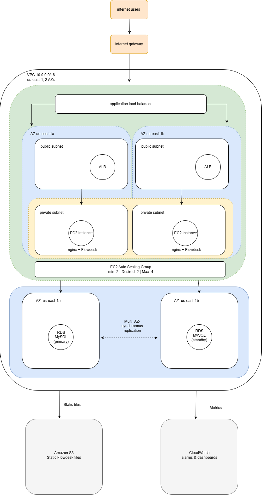

# Production-Grade AWS Infrastructure — Cost-Optimized and Fault-Tolerant

🔗 **Live Demo (Before – static site):** [Flowdesk](https://nicolemarise.github.io/Production-Grade-AWS-Infrastructure-Cost-Optimized-and-Fault-Tolerant-Public/FLowDesk/)

🔗 **Live Demo (After – AWS infra):** Deployed on-demand via Terraform to control cost — see full evidence below. Run `terraform apply` in the `terraform/` folder to bring it up live in ~15 minutes.

## The Business Challenge

The business required a **highly available and highly scalable application** capable of handling traffic spikes without downtime, while avoiding the unnecessary costs associated with idle servers.

## Solution

I designed a **highly available AWS infrastructure** targeting **10K requests per hour**, **99.99% uptime**, and a **40% reduction in operating costs** through Auto Scaling and a Multi-AZ architecture.

## Execution

I implemented a **Multi-AZ VPC** with public and private subnets, an **Application Load Balancer (ALB)** with health checks, **EC2 Auto Scaling based on CPU utilisation**, **Multi-AZ Amazon RDS in private subnets**, **Amazon S3 for static content**, and **Amazon CloudWatch alarms and dashboards** for monitoring and observability.

The project is divided into two parts:

- **Part A:** Manual design and deployment of the AWS infrastructure through the AWS Console, to build a deep understanding of every component before automating it.
- **Part B:** Automation of the identical infrastructure using Terraform (Infrastructure as Code), so it can be reproducibly created and destroyed on demand.

## Architecture Diagram

## Evidence

**Terraform apply — full infrastructure created from code:**

**Flowdesk running live on the Terraform-provisioned infrastructure:**

**Auto Scaling Group — 2/2 healthy across both Availability Zones:**

**RDS — Multi-AZ enabled:**

## Key decisions and trade-offs

- **S3 Gateway endpoint instead of a NAT Gateway.** Private-subnet EC2 instances only needed to reach Amazon Linux's S3-backed package repos and the app's own S3 bucket — both reachable for free through an S3 Gateway endpoint. This avoided ~$65+/month in NAT Gateway costs with no functional downside.
- **Multi-AZ RDS.** Chosen over single-AZ despite roughly doubling database cost, since high availability was an explicit requirement — a standby replica in a second AZ means the database survives an AZ outage.
- **Destroy-and-redeploy workflow instead of running 24/7.** Since this is a portfolio project rather than a live product, infrastructure is built, verified, and torn down between sessions. `terraform apply` recreates the entire stack in ~15 minutes; `terraform destroy` removes it cleanly. This is itself a demonstration of what Infrastructure as Code is for.
- **Manual build first, then automated.** Part A was built by hand through the console specifically to understand each AWS service before writing Terraform for it — the code in Part B is a direct translation of that manual build, not a template copied from elsewhere.
- **Broad IAM permissions for now.** The Terraform deployer IAM user uses `AdministratorAccess` for simplicity in a personal project. In a team/production setting, this would be scoped to only the specific services this code touches.

## Challenges faced

- Debugging security group rules and VPC/subnet placement when the ALB and EC2 instances couldn't initially reach each other.
- Working through IAM credential setup on a restricted machine without admin rights, and later fixing PATH/environment issues when moving to a personal machine.
- Handling naming conflicts between manually-created (Part A) and Terraform-managed (Part B) resources with identical names, which required a clean teardown before automating.
- A reminder mid-project that AWS access keys are as sensitive as passwords — rotating exposed keys immediately rather than assuming low risk.

## Lessons learned

- Building the same infrastructure twice — once by hand, once as code — made the Terraform code far easier to write and debug, since every resource and its purpose was already understood.
- Small cost-conscious decisions (S3 endpoint over NAT Gateway, destroy-between-sessions) add up to real savings without sacrificing the "production-grade" architecture story.
- Infrastructure as Code's real value showed up practically: recreating a Multi-AZ, load-balanced, auto-scaling stack from scratch took about 15 minutes with `terraform apply`, versus roughly 3-4 hours doing it manually through the console.

## Findings after working with Terraform

- **Environment variables beat a credentials file saved via Notepad.** I initially set up AWS credentials in `~/.aws/credentials` using Notepad, but kept hitting "No valid credential sources found" errors that turned out to be caused by Notepad silently saving the file with a `.txt` extension. Setting `AWS_ACCESS_KEY_ID` and `AWS_SECRET_ACCESS_KEY` as PowerShell environment variables instead was more reliable — no file, no encoding surprises, and easy to verify with `.Length` checks without ever exposing the actual values.
- **VS Code over AWS CloudShell for writing and running Terraform.** CloudShell is convenient for quick one-off AWS CLI commands, but it's an ephemeral session — no persistent Terraform extension, no real file explorer for a multi-module project, and no local git integration. Working in VS Code meant proper syntax highlighting and autocomplete for `.tf` files, a terminal scoped exactly to my project folder, and the ability to commit and push straight to GitHub without leaving the editor.
- **`terraform plan` surfaced real issues before they became expensive mistakes.** Running `plan` caught several problems before anything was created: a credentials signature mismatch from a stray space in a pasted secret key, missing IAM permissions on the deployer user (`ec2:DescribeImages`, `ec2:DescribeAvailabilityZones`), and naming collisions with leftover resources (a target group and DB subnet group) from the manual Part A build. Reading the plan output carefully — rather than skipping straight to `apply` — turned each of these into a two-minute fix instead of a failed deployment.

VPC creation success

VPC resource map

ALB creation success

Auto Scaling Group (Part A, manual build) — 2/2 healthy, Min 2 / Desired 2 / Max 4 across both AZs

Target group showing both EC2 instances registered and healthy

RDS database successfully created — MySQL, Multi-AZ, db.t3.micro

RDS configuration confirming Multi-AZ: Yes

CloudWatch dashboard covering EC2, ALB, and RDS metrics

CloudWatch high-CPU alarm successfully created

High-CPU alarm detail view, showing the CPUUtilization graph and threshold

terraform apply — 8 resources added, 0 changed, 0 destroyed

Evidence that terraform code worked: 

